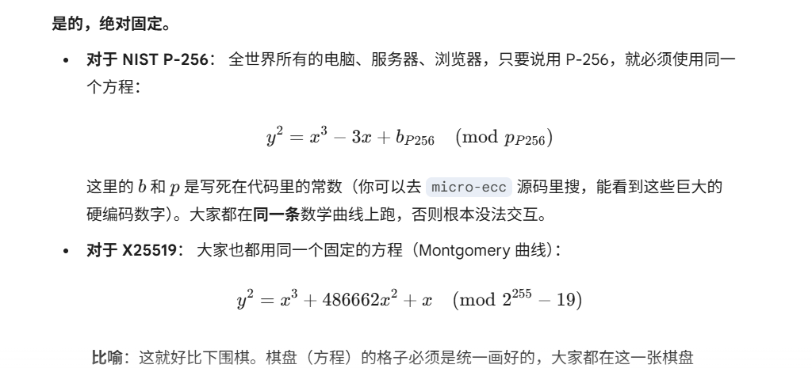
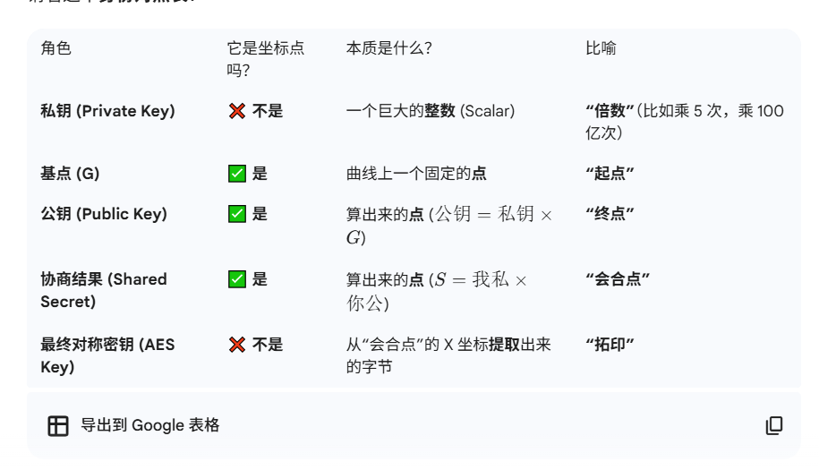
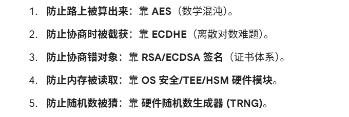

### 开源库算法实现核心对照表

| 核心环节 | micro-ecc (NIST P-256) | Monocypher (Curve25519 家族) |
| :--- | :--- | :--- |
| **密钥复用性** | **一套通用密钥** 同一对公私钥既用于交换 (ECDH) 也用于签名 (ECDSA) | **两套专用密钥** 通常使用不同的密钥对： 1. X25519 密钥对用于交换 2. Ed25519 密钥对用于签名 |
| **生成算法** | **Standard ECC KeyGen** 基于随机数生成私钥，$Q=dG$ 计算公钥 对应函数: `uECC_make_key()` | **X25519 / Ed25519 KeyGen** 包含位修剪 (Clamping) 等特殊操作 对应函数: `crypto_x25519_public_key()` |
| **交换算法** | **ECDH** (标准点乘) 基于 Short Weierstrass 曲线形式 对应函数: `uECC_shared_secret()` | **X25519** (Montgomery Ladder) 基于 Montgomery 曲线形式，只用 X 坐标运算，速度极快 对应函数: `crypto_x25519()` |
| **签名算法** | **ECDSA** 依赖高质量随机数，若随机数重复/被预测则私钥泄露 对应函数: `uECC_sign()` | **Ed25519** (EdDSA) 确定性签名 (Deterministic)，不需要随机数，杜绝了随机数源故障导致的风险 对应函数: `crypto_sign()` |

EC (Elliptic Curve) - EC(椭圆曲线) ：
EC 算法只需要 256 位bit长度的秘钥（如 P-256 或 X25519）就能达到同等安全性，计算速度极快，带宽占用极小。
DH (Diffie-Hellman) -（迪菲-赫尔曼）交换机制
迪菲-赫尔曼密钥交换（英语：Diffie–Hellman key exchange，缩写为D-H） 是一种安全协议。它可以让双方在完全没有对方任何预先信息的条件下通过不安全信道建立起一个密钥。
E (Ephemeral) —— 安全特性（最关键！） 每次生成新的一对

ECDHE 生成 交换必须用
签名

ECDH 仅需要生成和交换就可以协商出密钥
协商用到公私钥每个保存自己的私钥 扔公钥给对方
签名是为了防止我被中间人攻击了，导致实际是和黑客进行通信了

ecdhe有公认基点G：是全世界公开的标准常数，传输中发的是基点的坐标
Q = d × G
Alice： a A=a*G
Bob:  b B=b*G 
所以
a * b * G
b * a * G
协商出的对称密钥才相等

是因为椭圆曲线的除法（逆运算）在计算上不可行

私钥签名加密
公钥验签解密
你看着手里的一堆公开数据（G, A, B），唯独缺了最重要的私钥（a 或 b）。没有私钥，你就没法把它们“乘”在一起得到最终的 S

“后量子密码学” (Post-Quantum Cryptography, PQC)

为什么立方根比平方根更实用？
之所以全是“开平方”和“偶次方”，是因为：几何上：它是计算距离的基础。计算上：它是非线性问题中最简单、可解性最好的。性质上：偶次方能消除负号，衡量误差和能量时最方便。自然界：三维空间的物理定律天然偏爱平方反比。立方根 ($n=3$) 通常只在涉及体积、流体力学或者特定的晶体结构时才会大量出现，其通用性远不如平方根。

P-256 (几何法)：它做点乘运算时，类似于我们在纸上画切线。要确定切线的斜率，必须同时知道 X 和 Y。如果你只给它 X，它不知道点是在 x 轴上方还是下方，就没法算斜率，程序就崩了。X25519 (代数法)：它用了一种叫 Montgomery Ladder 的算法。这个算法很狡猾，它推导出一个公式，发现计算下一个点的 $x_{new}$ 只需要 上一个点的 $x_{old}$。它巧妙地消掉了 $y$。优点：不需要 Y，数据传输少一半（32字节 vs 64字节），且不用处理 Y 的正负号，速度飞快。

公钥和协商出的秘密本质上确实是曲线上的坐标点（或者点的 X 分量）；但私钥只是一个乘数（整数）

$Q = d \times G$
公钥=私钥 * G

$Q$ 和 $G$，求 $d$ 被称为 ECDLP（椭圆曲线离散对数问题）
G+G+G其实是斜切 取模
密码学基石：
大整数分解 离散对数问题

是因为：
因数分解和离散对数 现代计算机很笨 所以算不出来

RSA $\approx$ 拆大数 (大整数分解)。ECDHE $\approx$ 找步数 (椭圆曲线离散对数)。它们是两种不同的数学工具，在目前的互联网中，通常是 RSA 负责刷脸（签名），ECDHE 负责递钥匙（协商）。

现代互联网的【信任与握手机制】，本质上是由大整数分解和离散对数难题支撑的；而【数据传输】则是由混淆与扩散理论支撑的
而对称密钥之后算法就是让他混沌起来，推导不可逆：相当于原文-奇怪的密文，你无论如何都无法从大海里得到你原来的果汁

ECDHE（协商） + RSA/ECDSA（身份验证）

私钥的本质就是个随机数
只有随机的才安全
伪随机被知道规律会很麻烦，因为这样等于不用算 直接猜到了。