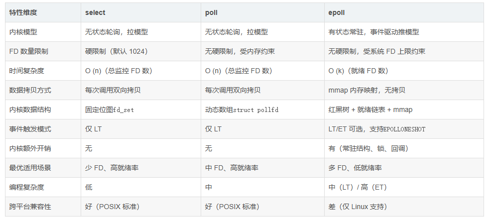
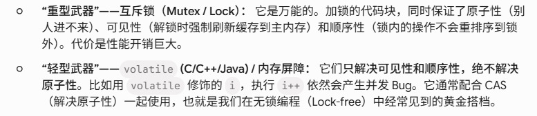

epoll  红黑树 就绪列表回调 mmap 自旋锁
高fd低就绪 EPOLLIN 读 EPOLLOUT 写
LT ET核心就在于就绪列表的事件是否删除
ET边缘触发 就是看缓冲区状态 对于读是空变非空 对于写事满变非满
in  可以是listen触发 也可以fd是写 也可以是fd关闭触发
out 可以是fd 非阻塞connect成功 也可以是数据可写

io_uring
3 syn syn ack ack
4 fin ack fin ack time_wait 2msl

多线程内存问题:
原子性（Atomicity） A：要么全做完，要么全不做，绝不准中途被打断 -- 操作系统的线程切换
可见性（Visibility）v：我在这边改了数据，你必须立刻就能看到 -- 多核 CPU 的多级缓存结构
顺序性（Ordering）  O：代码是怎么写的，机器就必须按什么顺序执行 -- 编译器的优化与 CPU 的动态指令调度。 只有这个单线程下无法保证
互斥锁：锁粒度大、业务耗时长  执行时相当于当线程
自旋锁：锁颗粒度小、业务耗时短
核心机制 (CAS - Compare-And-Swap)： “比较并交换”，取出的东西是否被改了，是否是原子的，被修改了不原子需要重新来，这是无锁编程基础
多核间的可见性和指令的顺序性。在 io_uring 或 DPDK 的无锁环形队列中，读写指针的更新必须配合内存屏障

避免共享 (Thread-Local Storage & RCU)
最高级的控制内存冲突的方法，就是从根本上不产生冲突。

TLS (Thread-Local Storage)： 给每个线程发一份变量的私有副本（比如 __thread int counter;）。大家各改各的，最后再由主线程汇总。没有任何锁，性能拉满。

RCU (Read-Copy-Update)： Linux 内核的心头好。读线程随便读，完全不加锁；写线程要修改数据时，先拷贝一份副本，在副本上改，改完用一个极其快速的原子指针替换操作（配合内存屏障），把原数据“掉包”。非常适合读多写少的极高并发场景。

控制方式,开销,解决的核心问题,典型应用场景
互斥锁 (Mutex),极高 (陷入内核/上下文切换),原子性、可见性、顺序性,复杂的业务逻辑、大块结构体的修改。
自旋锁 (Spinlock),中 (消耗 CPU 周期),原子性、可见性、顺序性,极短时间的临界区保护（如队列入列出列）。
原子操作 (CAS),低 (硬件总线锁/缓存锁),原子性,计数器统计、无锁状态机的状态翻转。
内存屏障 (Barrier),极低 (CPU流水线刷新),可见性、顺序性,配合原子操作，构建底层的无锁 Ring Buffer。

CAS 无法查看历史中是否变化 只能确定终值一致

经典问题ABA：
1、加一个版本号，既然值不确定有没有变化过，那就加一个版本号做为操作号
2、全局可见暂时不可删除内容
3、rcu等待所有线程任务结束再回收

所以内存安全武器其实就这几个：
内存屏障 （可见顺序）atomic（原子） 互斥锁/自旋锁（可见顺序原子）
特殊点：嵌入式硬件编程和**信号处理（Signal Handler）**设计的。比如你用 C 语言读写一个映射到外设（比如某块单片机的温度传感器）的内存地址，你需要告诉编译器：“这个地址的值可能被硬件随时改掉，你每次用必须去物理地址读，别用寄存器里的缓存！”
要么有锁编程 无锁编程就是atomic+内存屏障 ，开销上 互斥>自旋>无锁
竞争大 互斥>无锁>自旋
竞争小（线程小1-10）  无锁>自旋>互斥

#include <stat導入.h> // stdatomic.h
atomic_int counter = 0;

// 【流派 1：默认形态】原子性 + 可见性 + 顺序性 全都有
counter++; 

// 【流派 2：极致性能形态】“只保留原子性”，抛弃可见性和顺序性！
atomic_fetch_add_explicit(&counter, 1, memory_order_relaxed);

上面都是内存的理论：
实际上就是 互斥锁 自旋锁 c11原子量 和 条件变量（条件变量也只能配合互斥锁去操作）

互斥锁：解决了“多线程同时读写队列数据”的冲突问题（保证了检查动作的原子性）。
条件变量：解决了“如果没数据，线程怎么优雅地挂起等待”的问题。

所以除了上述三种 互斥+条件  自旋 c11原子量

应该尽量避免多线程共享内存带来的问题
1、pthread_setaffinity_np
2、多进程 + 共享内存 (Multi-process + shm)
3、Eventfd + Epoll 替代条件变量 (纯事件驱动化)